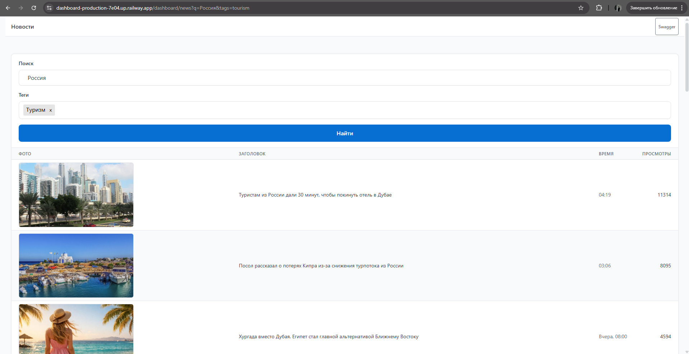

<h1 align="center">Дашборд новостей РИА</h1>

  
  

Это демонстрационный монорепозиторий: маленький **парсер** ходит на [РИА Новости](https://ria.ru), отдаёт данные через **REST API**, а **веб-дашборд** рисует форму (текст + теги), таблицу с превью, временем и просмотрами и пагинацию. 

## Это не production

Демо крутится на Railway ради удобной ссылки. Не рассчитывайте на стабильность: это демо-проект, он может прекратить работать в любой момент.

## Живые ссылки

- [Веб-дашборд](https://dashboard-production-7e04.up.railway.app/dashboard/news?q=%D0%A0%D0%BE%D1%81%D1%81%D0%B8%D1%8F&tags=tourism) — интерфейс поиска и списка новостей
- [Swagger парсера](https://exporter-production.up.railway.app/docs) — OpenAPI сервиса на FastAPI

## Экскурс по репозиторию

- **`exporter/`** — бэкенд на Python, который парсит данные с ria.ru и отдаёт их через HTTP API.
- **`dashboard/`** — веб-приложение на NestJS для отображения новостей и поиска, получает данные от exporter.
- **`.github/`** — скриншот для этого README и прочие служебные файлы.
- **`.pre-commit-config.yaml`** - pre-commit хуки.

Подробности запуска и устройства каждого сервиса — в README внутри соответствующей папки.

## Зачем так сложно

У РИА нет классической «антибот»-системы для каждого запроса, только защита от DOS через rate-limiting. Для чтения тех же URL теоретически хватило бы статического фронта без отдельного бэкенда. Отдельный **exporter** на Python плюс **Nest** с серверным рендером — осознанное усложнение под портфолио и задачу, а не минимально необходимый стек.
